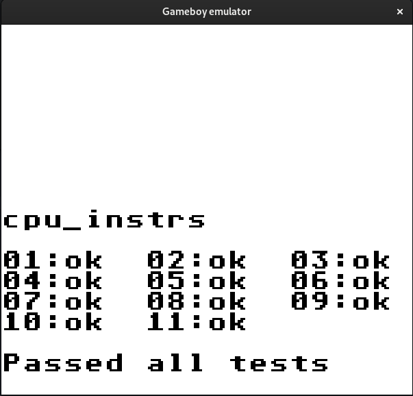
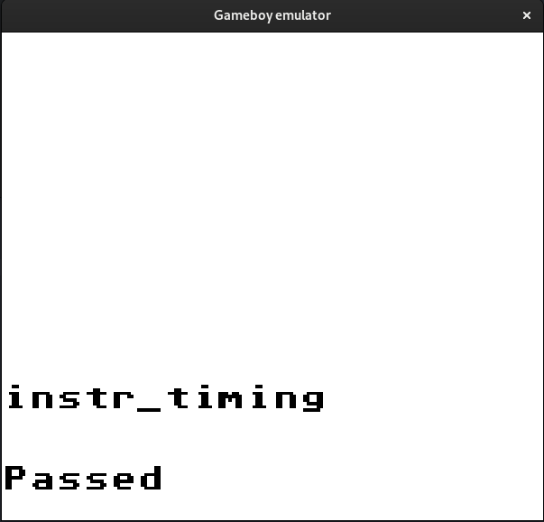
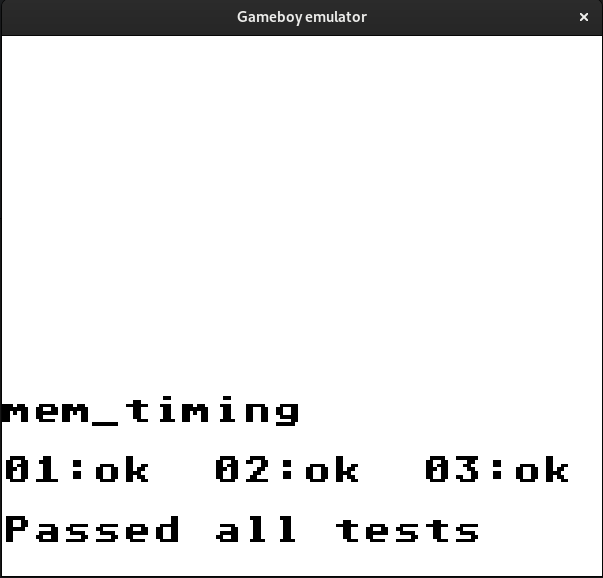

# Gameboy emulator

Work-in-progress Gameboy emulator written in Rust. Rendering is implemented using SDL2. Only supports DMG cartridges for now.

## Build
The project uses SDL2 for rendering, so make sure you have the dependencies for that.

``` sh
git clone https://github.com/walecome/gameboy-rs.git
cd gameboy-rs
cargo build
```

## Usage

Running:
``` sh
Usage: gameboy-rs [OPTIONS] --rom <ROM>

Options:
      --rom <ROM>
      --reference <REFERENCE>
      --trace-mode <TRACE_MODE>  [default: off] [possible values: off, with-boot, without-boot, serial]
      --headless
      --skip-boot-rom
  -h, --help                     Print help
```

Some simple ROM tests are included as well. This runs the compatible Blargg test ROMs (available in the submodule in `lib/`).

``` sh
./test.py
```

## Project status:
- [x] Blargg CPU tests
- [x] Blargg instruction timing tests
- [x] Blargg memory timing tests
- [x] PPU background rendering
- [ ] PPU window rendering
- [ ] PPU sprite rendering
- [x] MBC1 cartridge support
- [ ] Support for other cartridge types
- [ ] Joypad input
- [ ] Sound
- [ ] Gameboy color compatibility
- [ ] Debugger?

### Blargg CPU test:


### Blargg instruction timing test:


### Blargg memory timing test:

